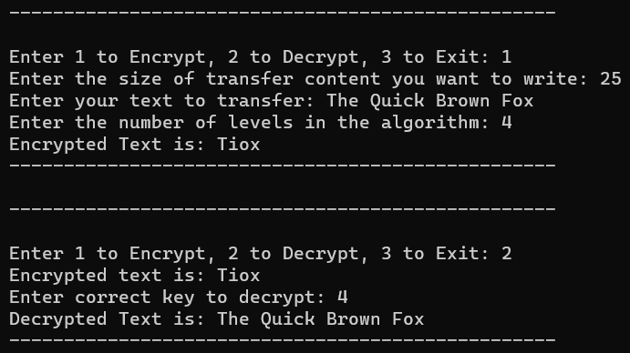

# Rail Fence Cipher
#### Simple implementation of encrypting data by writing into a file, reading it and decrypting it using keys using Rail Fence Cipher and File Handling in Vanilla C. 

#### (Note: The terminal output has some issues showing the output of reading & writing the encrypted message due to spaces ignore it)

# Advantages and Disadvantages
* **Advantage is the encryption and decryption of the algorithm takes O(N) time and space complexity where N is the size of the encrypted string.**
* **Even if the key isn't given the algorithm can be brute forced with all O(N^2) possible permuations of levels hence it's easily crackable if the string is small.**
